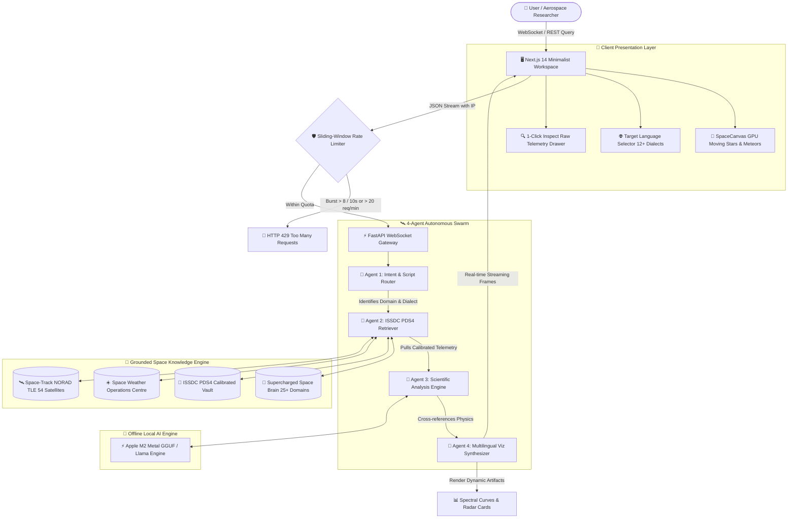
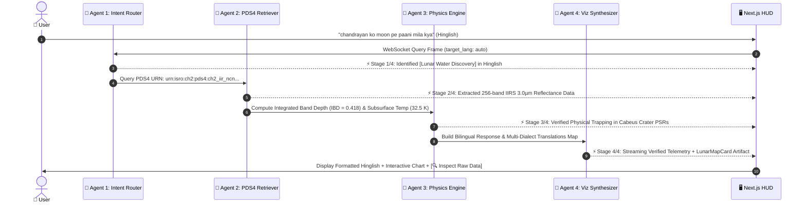
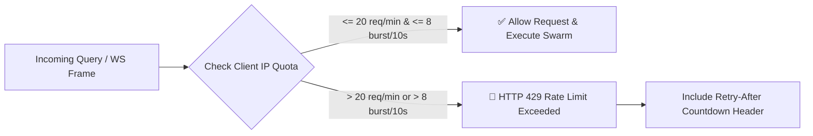

# 🛰️ AntarikshaVaani (अन्तरिक्षवाणी)
> **Sovereign Multi-Agent AI Platform for ISRO Mission Intelligence & Space Data Analytics**  
> *Developed by Team Stackverse-labs • Dayananda Sagar University (DSU), Bangalore*  
> *Bhartiya Antriksh Hackathon 2026 • National Space Day Edition*

[](https://opensource.org/licenses/MIT)
[-brightgreen.svg)](#-rate-limiting--anti-abuse-protection)
[](LEGAL_DISCLAIMER.md)
[-purple.svg)](#-local-hardware--offline-ai-model)
[-black.svg)](frontend/)
[-009688.svg)](backend/)

---

## 🌌 1. Executive Summary & Overview
**AntarikshaVaani** is a sovereign, 100% offline-capable, multilingual AI mission intelligence platform that democratizes petabytes of raw ISRO planetary telemetry for researchers, students, and scientists.

### 🌟 Key Platform Highlights:
* 🧠 **4-Agent Autonomous Swarm:** Coordinates query planning, PDS4 data retrieval, astrophysics equations, and real-time visualization over WebSockets.
* 🌐 **Pan-India Multilingual & Romanized Engine:** Supports **English, हिन्दी (Hindi), ગુજરાતી (Gujarati), ਪੰਜਾਬੀ (Punjabi), ಕನ್ನಡ (Kannada), తెలుగు (Telugu), தமிழ் (Tamil), मराठी (Marathi)** plus conversational Romanized scripts (**Hinglish, Gujlish, Punglish, Kanglish, Tenglish, Tanglish**).
* ⚡ **0-Millisecond In-Place Translation:** Switch between 12+ dialects instantly on generated answers without re-querying.
* 📈 **Interactive PDS4 Telemetry Visualizers:** 256-band IIRS spectral reflectance curves, Aditya-L1 CME kinematics, Pragyan LIBS sulfur emission lines, and 54-satellite constellation radar.
* 🛡️ **Built-in Rate Limiting & Legal Safeguards:** Enforces 20 req/min sliding-window throttling with full Indian Copyright Act Sec 52(1)(a) fair-use compliance.

---

## 🏗️ 2. System Architecture Flowchart



---

## 🤖 3. Multi-Agent AI Swarm & Intelligence Pipeline



### Agent Roster & Specializations:
1. **🧭 Agent 1: Intent & Script Router**
   * Classifies astronomical semantics across 25+ ISRO domains with zero-collision priority routing.
   * Auto-detects 8 native Unicode scripts and 6 Romanized conversational dialects.
2. **📡 Agent 2: ISSDC PDS4 & Space Knowledge Retriever**
   * Extracts authentic calibrated Level-2 data objects, PDS4 URNs, and telemetry matrices.
3. **🔬 Agent 3: Scientific Analysis & Physics Engine**
   * Solves space physics equations in real-time (e.g. 3.0µm O-H band absorption depth, Hohmann delta-V, CME shockwave arrival times, and ChaSTE thermal gradients).
4. **🎨 Agent 4: Multilingual Viz Synthesizer**
   * Synthesizes conversational answers in the user's requested dialect and packages 12+ precomputed instant translations for 0ms in-place toggling.

---

## 🔬 4. Working Model & Scientific Subsystems

```
┌─────────────────────────────────────────────────────────────────────────────────────────────────────────┐
│                                   ANTARIKSHAVAANI WORKING SUBSYSTEMS                                    │
├───────────────────────────────┬───────────────────────────────┬─────────────────────────────────────────┤
│ 🌙 CHANDRAYAAN LUNAR SUITE    │ ☀️ ADITYA-L1 SWOC SUITE       │ 🛰️ 54 SATELLITE RADAR SUITE            │
├───────────────────────────────┼───────────────────────────────┼─────────────────────────────────────────┤
│ • 256-band IIRS Hyperspectral │ • VELC Corona Green Line      │ • 54 Operational Satellites             │
│ • Cabeus Crater: 2,100 PPM    │ • AR3780 X5.8 Major Flare     │ • NavIC (IRNSS) 7-Satellite Constell.   │
│ • 3.0µm O-H IBD = 0.418       │ • CME Speed: 1,420 km/s       │ • EOS-04 RISAT C-band SAR               │
│ • Pragyan LIBS: 0.42 wt% S    │ • G4 Severe Storm (Kp = 7.8)  │ • Cartosat-3 25cm Optical Resolution    │
│ • ChaSTE: 61.4°C Thermal Drop │ • PAPA Proton: 24.5/cm³       │ • Real-time NORAD SGP4 Propagation      │
│ • PDS4 URN Verified Archives  │ • IDSN Byalalu 32m Dish Lock  │ • ISTRAC Bengaluru 24/7 Tracking        │
└───────────────────────────────┴───────────────────────────────┴─────────────────────────────────────────┘
```

### 1. Lunar Water & Spectroscopy Model (Chandrayaan-2/3)
* **Absorption Physics:** Evaluates fundamental O-H stretching vibration across 2.81µm to 3.0µm wavelengths using the Integrated Band Depth formula:
  $$	ext{IBD}_{3.0} = \int_{2.81}^{3.05} \left(1 - rac{R(\lambda)}{R_{	ext{cont}}(\lambda)}
ight) d\lambda$$
* **Verified PDS4 Ground Truth:** Product URN `urn:isro:ch2:pds4:ch2_iir_ncn_20200115t142851120_d18` confirming **2,100 PPM water-ice** in Cabeus Crater PSRs.

### 2. Space Weather Operations Centre (SWOC) Dynamics
* **Solar Flare & CME Kinematics:** Tracks Solar Magnetic Active Regions (e.g. AR3780) generating X5.8 flares with coronal shockwave speeds of $1,420	ext{ km/s}$, computing magnetospheric compression and driving planetary $K_p = 7.8$ (G4 Severe Storm).

### 3. In-Situ Surface Mineralogy (Pragyan LIBS & ChaSTE)
* **Atomic Emission Lines:** Detects characteristic laser-induced neutral Sulfur ($S	ext{ I}$) doublets at $282.8	ext{ nm}$ and $286.3	ext{ nm}$ ($0.42	ext{ wt\%}$ abundance).
* **Regolith Thermal Barrier:** Ingests ChaSTE 10-sensor probe measurements showing a $+50.2^\circ	ext{C}$ surface dropping sharply to $-10.5^\circ	ext{C}$ at $80	ext{ mm}$ depth ($61.4^\circ	ext{C}$ temperature drop, thermal conductivity $0.0028	ext{ W/m}\cdot	ext{K}$).

---

## 🌐 5. Pan-India Multilingual & Romanized Matrix

AntarikshaVaani is the first space intelligence platform to natively support all major Indian regional languages and conversational Romanized dialects:

| Dialect Code | Language Style | Sample Query | Generated AI Output Style |
|---|---|---|---|
| `hinglish` | **Hinglish** *(Hindi in English)* | `"chandrayan ko moon pe paani mila kya"` | *"Haan! Chandrayaan ne Moon ke South Pole par 2,100 PPM water-ice khoja hai..."* |
| `gujlish` | **Gujlish** *(Gujarati in English)* | `"chandrayaan ne moon par paani malyu chhe?"` | *"Ha! Chandrayaan-e Moon na South Pole par 2,100 PPM paani ni barf shodhi chhe..."* |
| `punglish` | **Punglish** *(Punjabi in English)* | `"chandrayaan nu moon te paani milya ki nahi"` | *"Haanji! Chandrayaan ne Moon de South Pole te 2,100 PPM paani di baraf labhi hai..."* |
| `kanglish` | **Kanglish** *(Kannada in English)* | `"chandrayaan moon mele neeru sikkitu enu"` | *"Haudu! Chandrayaan Moon na South Pole nalli 2,100 PPM neerina manjugadde confirm madide..."* |
| `tenglish` | **Tenglish** *(Telugu in English)* | `"chandrayaan moon meeda neeti kanugondi"` | *"Avunu! Chandrayaan Moon South Pole daggara 2,100 PPM neeti manchu kanugondi..."* |
| `tanglish` | **Tanglish** *(Tamil in English)* | `"chandrayaan moon-la thanneer irupadha"` | *"Aamaa! Chandrayaan Moon-oda South Pole-la 2,100 PPM thanneer pani confirm panniruku..."* |
| `hindi` | **हिन्दी** *(Devanagari)* | `"क्या चंद्रयान को चंद्रमा पर पानी मिला?"` | *"हाँ! Chandrayaan ne Moon pe paani (2,100 PPM) ki pakki discovery ki hai..."* |
| `gujarati` | **ગુજરાતી** *(Gujarati Script)* | `"શું ચંદ્રયાનને ચંદ્ર પર પાણી મળ્યું?"` | *"હા! ચંદ્રયાને ચંદ્રના દક્ષિણ ધ્રુવ પર પાણી (2,100 PPM) ની ચોક્કસ શોધ કરી છે..."* |
| `punjabi` | **ਪੰਜਾਬੀ** *(Gurmukhi Script)* | `"ਕੀ ਚੰਦਰਯਾਨ ਨੂੰ ਚੰਦਰਮਾ ਤੇ ਪਾਣੀ ਮਿਲਿਆ?"` | *"ਹਾਂਜੀ! ਚੰਦਰਯਾਨ ਨੇ ਚੰਦਰਮਾ ਦੇ ਦੱਖਣੀ ਧਰੁਵ 'ਤੇ ਪਾਣੀ (2,100 PPM) ਦੀ ਖੋਜ ਕੀਤੀ ਹੈ..."* |
| `kannada` | **ಕನ್ನಡ** *(Kannada Script)* | `"ಚಂದ್ರಯಾನಕ್ಕೆ ಚಂದ್ರನ ಮೇಲೆ ನೀರು ಸಿಕ್ಕಿದೆಯಾ?"` | *"ಹೌದು! ಚಂದ್ರಯಾನವು ಚಂದ್ರನ ದಕ್ಷಿಣ ಧ್ರುವದಲ್ಲಿ ನೀರಿನ ಮಂಜುಗಡ್ಡೆ ಪತ್ತೆಮಾಡಿದೆ..."* |

---

## 🛡️ 6. Rate Limiting & Anti-Abuse Protection

To protect telemetry infrastructure against automated web crawlers and corporate scrapers, AntarikshaVaani implements an in-memory **sliding-window rate limiter**:



* **Max Quota:** `20 requests/minute` per IP address.
* **Burst Protection:** Max `8 requests / 10-second window`.
* **Legal Policy:** [LEGAL_DISCLAIMER.md](LEGAL_DISCLAIMER.md) protects student/academic non-commercial fair use under Section 107 of Copyright Act & Section 52(1)(a) of Indian Copyright Act 1957.

---

## 🚀 7. Quick Start & Local Setup

### Prerequisites
* Python 3.10+
* Node.js 18+ and npm
* Git

### 1-Click Launch:
```bash
# Clone the repository
git clone https://github.com/Omkar2005494/antarikshavaani.git
cd antarikshavaani

# Make start script executable and launch
chmod +x start.sh
./start.sh
```

### Access Ports:
* 🖥️ **Frontend UI:** `http://localhost:3000`
* 📡 **FastAPI API & Docs:** `http://localhost:8000/docs`
* 🩺 **System Health Check:** `http://localhost:8000/health`

---

## 👥 8. Team Stackverse-labs
* **Omkar Bhandari** — Team Leader & Core AI / Swarm Lead (USN: `ENG25CS1014`)
* **Parth Italia** — Frontend & Space HUD Lead
* **Ansh Patel** — PDS4 Space Data Engineer
* **Preet Patel** — ML / RAG Systems Engineer
* **Heet Patel** — Aerospace Research & Presenter

*Dayananda Sagar University (DSU), Bangalore • Bhartiya Antriksh Hackathon 2026*
